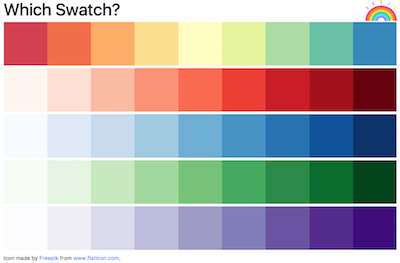

# Problem A

In this exercise, you will practice using JavaScript to manipulate the DOM. In particular, you will dynamically generate a visualization of some color schemes:



To complete the exercise, edit the included **`js/index.js`** file to add in the code described in the comments. Note that you should ___not___ edit the HTML file!

You can see the results of your work by opening up the included `index.html` file in a browser. Remember to refresh the page after you update your code, and to check for any errors in the Developer console.

## Testing
This exercise includes a test suite to verify that modified DOM is correct. Note that this test is simply to help you verify your results; it will not ensure that your code follows the required syntactical approach.

You can run the test suite using

```bash
jest problemA
```
